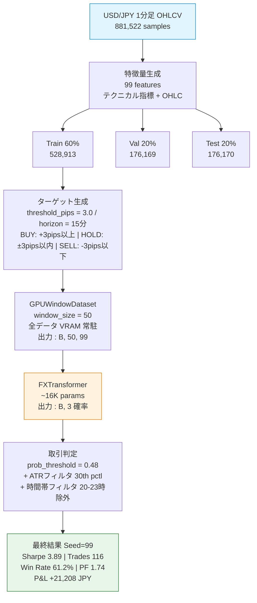
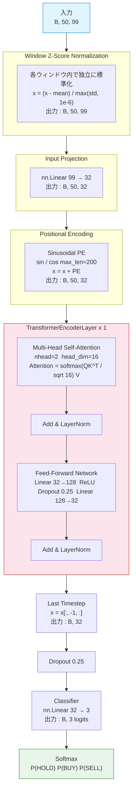
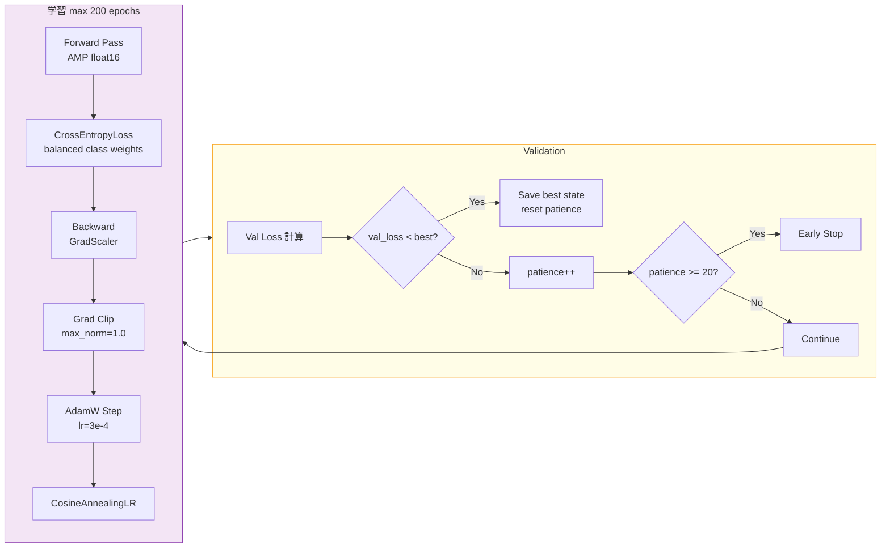
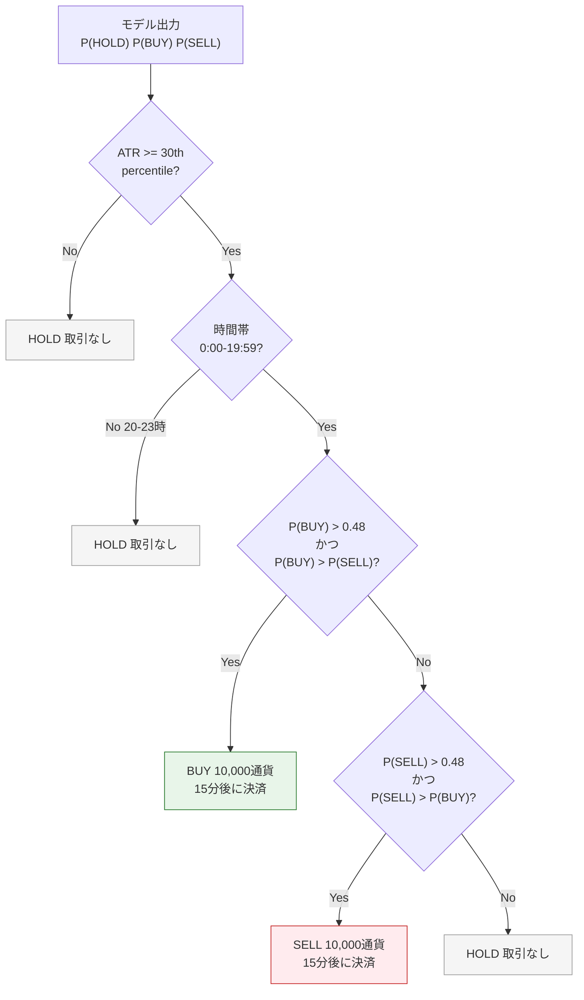

# Ralph Loop — モデルアーキテクチャ

## 全体パイプライン

## FXTransformer 内部構造

## 学習ループ

## 取引判定フロー

## パラメータ数

| レイヤー | 計算式 | パラメータ数 |
|----------|--------|-------------|
| input_proj | 99x32 + 32 | 3,200 |
| PositionalEncoding | 固定バッファ | 0 |
| Self-Attention (Q,K,V,O) | 4x(32x32 + 32) | 4,224 |
| FFN | 32x128+128 + 128x32+32 | 8,352 |
| LayerNorm x 2 | 2x(32+32) | 128 |
| classifier | 32x3 + 3 | 99 |
| **合計** | | **16,003** |

## 学習設定

| 項目 | 値 |
|------|-----|
| Optimizer | AdamW (lr=3e-4) |
| Scheduler | CosineAnnealingLR |
| Loss | CrossEntropyLoss (balanced class weights) |
| Mixed Precision | AMP (float16 forward, float32 grad) |
| Gradient Clipping | max_norm=1.0 |
| Batch Size | 512 |
| Max Epochs | 200 |
| Early Stopping | patience=20 |
| Random Seed | 99 |

## コスト構造

| 項目 | 値 |
|------|-----|
| スプレッド | 0.2 pips (Bid/Ask時不要) |
| スリッページ | 0.1 pips |
| API手数料 | 0.002% per side |
| ポジションサイズ | 10,000通貨 |

## 最終成績

| 指標 | 値 |
|------|-----|
| Sharpe Ratio | **3.89** |
| Total P&L | **+21,208 JPY** |
| Total Trades | **116** |
| Win Rate | **61.2%** |
| Profit Factor | **1.74** |
| Max Drawdown | **-8,114 JPY** |
| Calmar Ratio | **8.26** |
| Avg Win | +703 JPY |
| Avg Loss | -639 JPY |
| Win/Loss Ratio | 1.10x |
